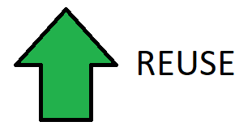
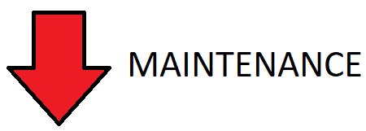

# Variables

<div class="tab">
  <button class="tablinks active" onclick="openTab(event, 'Overview')">Overview</button>
  <button class="tablinks" onclick="openTab(event, 'What')">What</button>
  <button class="tablinks" onclick="openTab(event, 'Example')">Example</button>
  <button class="tablinks" onclick="openTab(event, 'Why')">Why</button>
  <button class="tablinks" onclick="openTab(event, 'ToDo')">To Do</button>
  
</div>
<!-- Tab content -->
<div id="Overview" class="tabcontent" style="display:block">

<div class="tabhtml" markdown="1">

In MART 120, we talked about the variables, but I always think it's good to revisit and make sure we feel comfortable before moving on.

<a href="https://montana-media-arts.github.io/120_CreativeCoding1-Fall2020/modules/week-10/variables/" target="_new">MART 120 Variables</a>

</div>
</div>

<!-- Tab content -->
<div id="What" class="tabcontent">

<div class="tabhtml" markdown="1">

What is a variable?

The dictionary defines a variable like this

**an element, feature, or factor that is liable to vary or change.**

What does that mean to us in programming?

<a href="//youtu.be/tHYis-DP0oU" data-lity>Video on Variables</a>

</div>
</div>
<div id="Example" class="tabcontent">

<div class="tabhtml" markdown="1">

First, we define the favoriteFood variable.

```js
    var favoriteFood = 'pizza';
```

Then, we can update the favoriateFood variable with a new value.

```js
    favoriteFood = 'burrito';
```   

Here is the full example.

```js
    // create the variable
    var favoriteFood = "pizza";
    // this is the setup function - it's run only once
    function setup()
    {
        createCanvas(600,800);
        // print the variable to the console
        console.log(favoriteFood);
    }
    // the draw function is called over and over
    function draw()
    {
        // change the value of the favoriteFood variable
        favoriteFood = "burrito";
        // print out the new variable value in the console
        console.log(favoriteFood);
    }
```

</div>
</div>
<div id="Why" class="tabcontent">

<div class="tabhtml" markdown="1">

When we look at the previous example, it might not be obvious why we want to use variables.  So, what is the benefit?  Variables allow us to change their values throughout the program.  The main concepts are:

* reusability
* maintainability

We want to reuse as much as we can and lower our maintanance.  We will always have to make changes and if we can reduce the amount of work it takes to make those changes that is a good thing.




</div>
</div>

<div id="ToDo" class="tabcontent">
<div class="tabhtml" markdown="1">

Try the code in the earlier tabs and change the redColor variable. 

<iframe src="https://editor.p5js.org/" width="100%" height="800px"></iframe>

</div>
</div>
