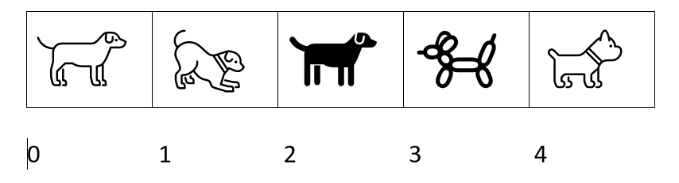

# Arrays

<div class="tab">
  <button class="tablinks active" onclick="openTab(event, 'Overview')">Overview</button>
  <button class="tablinks" onclick="openTab(event, 'What')">What</button>
  <button class="tablinks" onclick="openTab(event, 'Why')">Why</button>
  <button class="tablinks" onclick="openTab(event, 'ToDo')">To Do</button>
 
</div>

<div id="Overview" class="tabcontent" style="display:block"  >
<div class="tabhtml" markdown="1">

In this next section, we start working with arrays. They may seem intimidating at first, but believe when I tell you that your life will be much better once you have them down.

</div>
</div>

<div id="What" class="tabcontent">
<div class="tabhtml" markdown="1">

### What

 An array is a data structure that contains a group of elements. Typically these elements are all of the same data type, such as an Number or string. Arrays are commonly used in computer programs to organize data so that a related set of values can be easily sorted or searched. [From Tech Terms](https://techterms.com/definition/array)

An array is a collection of data in "indexed" locations.

Okay this is another technical thing.  So, let's loo kat a picture and see what that means.



Here you have an image showing 5 different dogs (they are all the same type though).  Keep in mind though that when we count arrays, they always start at zero.  So it goes from 0 through the size minus 1 or in this case 0 to 4.

</div>
</div>

<div id="Why" class="tabcontent">
<div class="tabhtml" markdown="1">

### Why

Why do we care?  Arrays give us a easier way to keep track of all the things we want to display.  It also reduces the number of variables we have to keep track of.  We can use for loops to populate arrays and we can use the draw to draw everything to the screen. 

### Syntax

So, this is what an array looks like in p5.js.

```js

var myArray = [];

```

This is how we can declare an array.

If I want to add something to it, I can do this:

```js

myArray[0] = 1;
myArray[1] = 3;
myArray[2] = 5;

```

Notice, I am access each index and then putting a number in there.

To access the indices, I can do this:

```js

var myArray = [];

myArray[0] = 1;
myArray[1] = 3;
myArray[2] = 5;

function setup()
{
   createCanvas(800,600);
}

function draw()
{
    background(120);
    text(myArray[0], 100, 100);
    text(myArray[1], 200, 200);
    text(myArray[2], 300, 300);
}

```

</div>
</div>

<div id="ToDo" class="tabcontent">
<div class="tabhtml" markdown="1">
Try the code in the earlier tabs to see the final result. Feel free to change values.

<iframe src="https://editor.p5js.org/" width="100%" height="800px"></iframe>
</div>
</div>


